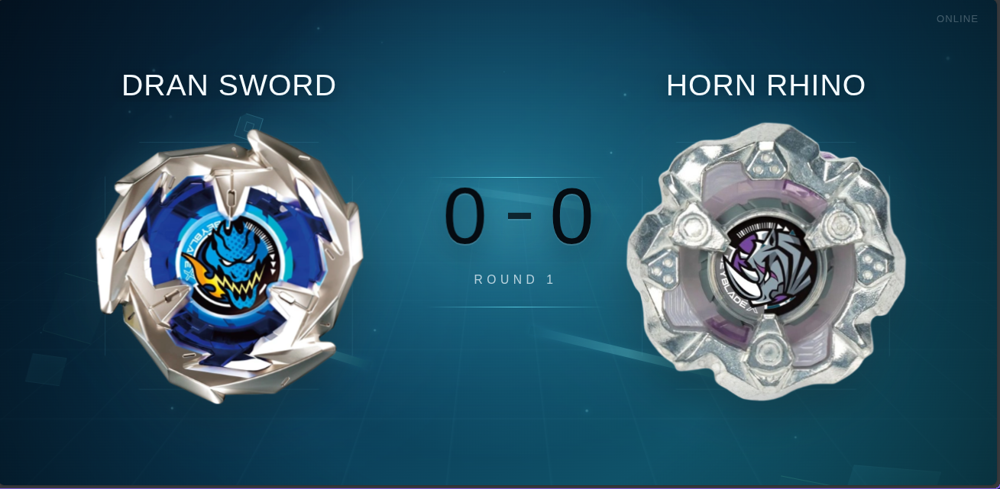
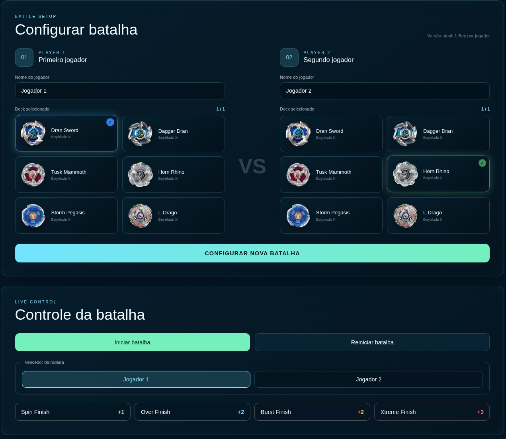

# Score_BeyX

Score_BeyX é uma engine de overlay para batalhas de **Beyblade X**, criada para controlar placar, finalizações, jogadores e HUDs em tempo real.



O projeto possui um painel de controle para configurar batalhas e registrar resultados, enquanto as telas de overlay são atualizadas automaticamente através de Socket.IO.

## Funcionalidades atuais

- Configuração de batalhas 1x1 pelo Controller
- Catálogo de Beys
- Seleção visual dos Beys
- Nome personalizado para os jogadores
- Placar em tempo real
- Registro de Spin Finish, Over Finish, Burst Finish e Xtreme Finish
- Reinício de batalha
- Tela de vencedor
- HUD Prototype com animações e efeitos
- Comunicação em tempo real com Socket.IO
- Arquitetura preparada para múltiplos HUDs
- Estrutura de Deck preparada para até 3 Beys

> O foco da versão atual é o modo 1x1. O suporte completo a Deck Match com 3 Beys será desenvolvido futuramente.

## Tecnologias

- Node.js
- Express
- Socket.IO
- HTML
- CSS
- JavaScript

## Requisitos

Tenha instalado:

- Node.js
- npm

Uma versão LTS do Node.js é recomendada.

## Instalação

Clone o repositório:

```bash
git clone <URL_DO_REPOSITORIO>
```

Entre na pasta:

```bash
cd Score_BeyX
```

Instale as dependências:

```bash
npm install
```

## Executando o projeto

### Desenvolvimento

```bash
npm run dev
```

### Execução normal

```bash
npm start
```

Por padrão, o servidor utiliza a porta `3000`.

## Endereços

### Scoreboard

```text
http://localhost:3000/
```

### Controller

```text
http://localhost:3000/controller
```

### Prototype HUD

```text
http://localhost:3000/themes/prototype
```

### Health Check

```text
http://localhost:3000/health
```

### API de Beys

```text
http://localhost:3000/api/beys
```

## Como configurar uma batalha

1. Abra `/controller`.
2. Digite o nome dos dois jogadores.
3. Selecione um Bey para cada jogador.
4. Clique em **Configurar nova batalha**.
5. Abra o HUD desejado em outra aba, monitor ou dispositivo.
6. Clique em **Iniciar batalha**.
7. Selecione o vencedor da rodada.
8. Registre o tipo de Finish.
9. O placar e o HUD serão atualizados automaticamente.



## Beys cadastrados atualmente

- Dran Sword
- Dagger Dran
- Tusk Mammoth
- Horn Rhino
- Storm Pegasis
- L-Drago

As imagens compartilhadas dos Beys ficam em:

```text
public/assets/beys/
```

## Estrutura do projeto

```text
Score_BeyX/
├── design/
├── docs/
├── public/
│   ├── assets/
│   ├── controller/
│   ├── scoreboard/
│   └── themes/
├── src/
│   ├── catalog/
│   ├── config/
│   ├── core/
│   ├── domain/
│   ├── errors/
│   ├── http/
│   ├── shared/
│   └── socket/
├── package.json
└── server.js
```

### `design/`

Referências, wireframes, inspirações e planejamento visual dos temas.

### `docs/`

Documentação interna, visão do projeto, arquitetura e roadmap.

### `public/`

Arquivos enviados ao navegador.

### `src/catalog/`

Fonte oficial dos Beys disponíveis no sistema.

### `src/core/`

Coordena a aplicação e os principais serviços: `App`, `BattleFactory`, `BattleManager` e `EventBus`.

### `src/domain/`

Regras e entidades principais da batalha, como `Battle`, `Deck`, `Finish` e `Player`.

### `src/http/`

Servidor Express e rotas HTTP/API.

### `src/shared/`

Eventos, enums e constantes compartilhadas.

### `src/socket/`

Comunicação em tempo real entre backend, Controller e HUDs.

## Como adicionar um novo Bey

### 1. Adicione a imagem

Coloque a imagem em:

```text
public/assets/beys/
```

### 2. Cadastre no catálogo

Edite:

```text
src/catalog/beys.js
```

Exemplo:

```javascript
{
    id: "novo-bey",
    name: "Novo Bey",
    generation: "X",
    series: "Beyblade X",
    avatar: "/assets/beys/novo-bey.png",

    theme: {
        primary: "#000000",
        secondary: "#000000",
        glow: "#000000"
    }
}
```

Depois de reiniciar o servidor, o novo Bey será disponibilizado pela API e aparecerá no Controller.

## Sistema de temas

Os HUDs ficam em:

```text
public/themes/
```

O primeiro tema completo é:

```text
public/themes/prototype/
```

O Prototype possui componentes independentes para Background, Finish Banner, Loading Screen, Player Card, Score Counter, Timeline e Winner Screen.

## API

### `GET /api/beys`

Retorna o catálogo de Beys.

### `POST /api/battle`

Cria/configura uma nova batalha utilizando os nomes dos jogadores e os IDs dos Beys selecionados.

Exemplo:

```json
{
    "player1": {
        "name": "Yan",
        "deck": ["dran-sword"]
    },
    "player2": {
        "name": "Pedro",
        "deck": ["storm-pegasis"]
    }
}
```

## Roadmap

- novos temas de HUD
- efeitos específicos por Bey
- HUD temático do Storm Pegasis
- suporte completo a Deck Match com 3 Beys
- seleção de ordem 1 / 2 / 3
- troca de Bey ativo
- mais Beys no catálogo
- novos efeitos visuais e sonoros
- melhorias para torneios e transmissões

## Licença

MIT.

## Autor

Yan Ricardo